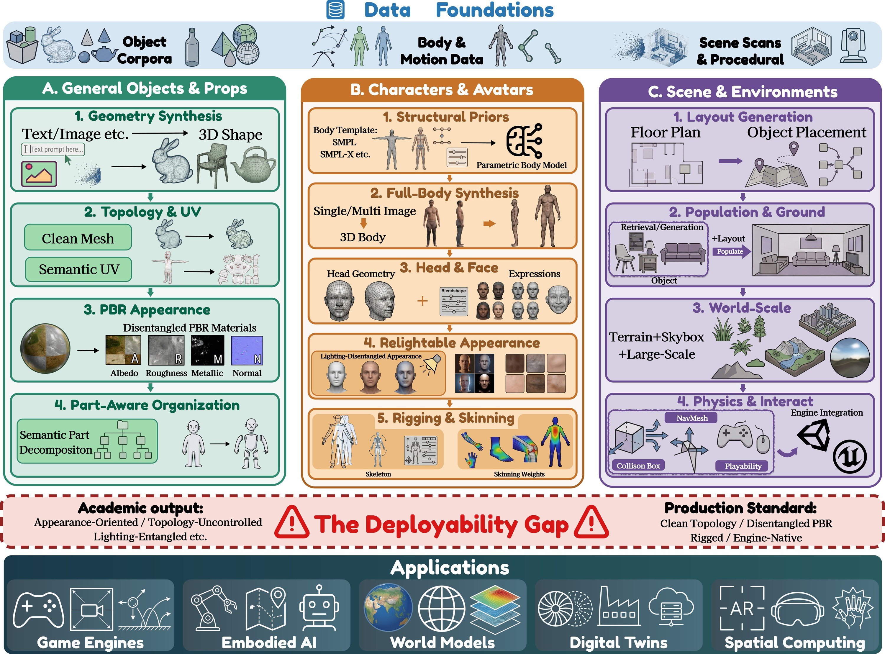
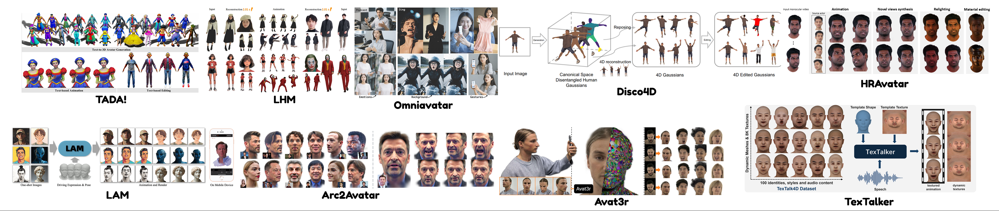

# From Visual Synthesis to Interactive Worlds: <br> Toward Production-Ready 3D Generation

<p align="center">
  <a href="https://arxiv.org/abs/2026.xxxxx"></a>
  <a href="https://dl.acm.org/"></a>
  <a href="https://christinebobby.github.io/production-ready-3d-survey/"></a>
  <a href="https://github.com/hitcslj/Awesome-AIGC-3D"></a>
  <a href="LICENSE"></a>
</p>

<p align="center">
  <strong>Jiafeng Wu</strong><sup>1,2*†</sup> &nbsp;·&nbsp;
  <strong>Zhuofan Lou</strong><sup>1,3*†</sup> &nbsp;·&nbsp;
  <strong>Jian Liu</strong><sup>1‡</sup><br>
  <strong>Chunchao Guo</strong><sup>4</sup> &nbsp;·&nbsp;
  <strong>Dazhao Du</strong><sup>1</sup> &nbsp;·&nbsp;
  <strong>Song Guo</strong><sup>1§</sup>
</p>

<p align="center">
  <strong><sup>1</sup> The Hong Kong University of Science and Technology</strong><br>
  <strong><sup>2</sup> Huazhong University of Science and Technology</strong> &nbsp;·&nbsp;
  <strong><sup>3</sup> Sichuan University</strong> &nbsp;·&nbsp;
  <strong><sup>4</sup> Tencent</strong>
</p>

<p align="center">
  <em><strong>*</strong> Equal contribution &nbsp;·&nbsp; <strong>†</strong> Work done during internship at HKUST &nbsp;·&nbsp; <strong>‡</strong> Project lead &nbsp;·&nbsp; <strong>§</strong> Corresponding author</em>
</p>

<p align="center">
  <strong>✦ Production-Oriented 3D Generation Survey ✦</strong><br>
</p>

<p align="center">
  <a href="#survey-taxonomy">🧭 Taxonomy</a> ·
  <a href="#data-foundations--benchmarks">🗂 Data</a> ·
  <a href="#general-objects--props">📦 Objects</a> ·
  <a href="#characters--avatars">🧍 Characters</a> ·
  <a href="#scenes--environments">🌍 Scenes</a> ·
  <a href="#evaluation--benchmarks">📏 Evaluation</a> ·
  <a href="#industry--companies">🏭 Industry</a>
</p>

<p align="center">
  
</p>

## News

- 🔥 **[2026-04]** v2.0: Introduces a production-ready two-dimensional taxonomy spanning asset tiers and pipeline stages, and expands the collection to data foundations, geometry, topology, appearance, rigging, scene assembly, evaluation, and industry systems.
- 📚 **[2025-08]** v1.0: Established the initial curated 3D AIGC paper collection, organized object, scene, and avatar methods under 3D-native, 2D-prior, and hybrid paradigms, and tracked surveys, datasets, talks, companies, and implementations.

## Abstract

Three-dimensional content generation has progressed from producing isolated, visually plausible shapes to constructing structured assets that can be deployed in real-time interactive environments. This trajectory is driven by converging demands from game development, embodied AI, world simulation, digital twins, and spatial computing, all of which require 3D content that goes beyond surface appearance to satisfy engine-level constraints on topology, UV parameterization, physically based materials, skeletal rigging, and physics-aware scene layout. Despite rapid advances in generative modeling, a persistent gap separates the outputs of current methods from the production-ready standard expected by interactive applications. This survey addresses that gap by organizing the literature around the asset production pipeline rather than algorithmic families.

> **At a Glance**
>
> - 🧭 Organized by a production-ready, pipeline-first taxonomy rather than isolated algorithm families.
> - 📦 Covers three asset tiers: general objects, characters and avatars, and scenes and environments.
> - 🛠 Tracks the full asset workflow from data foundations through geometry, topology, appearance, rigging, and scene assembly.
> - 📚 Consolidates methods, datasets, evaluation criteria, and industry references in one companion list.

---

## Table of Contents

- 🧭 [Survey Taxonomy](#survey-taxonomy)
- 🗂 [Data Foundations & Benchmarks](#data-foundations--benchmarks)
  - 📦 [Object Datasets](#object-datasets)
  - 🧍 [Character Datasets](#character-datasets)
  - 🌍 [Scene Datasets](#scene-datasets)
- 📦 [General Objects & Props](#general-objects--props)
  - 🧱 [Geometry Generation](#geometry-generation)
  - 🕸 [Topology Generation](#topology-generation)
  - 🎨 [Appearance Generation](#appearance-generation)
- 🧍 [Characters & Avatars](#characters--avatars)
  - 🧬 [Structural Priors](#structural-priors)
  - 👤 [Full-Body Synthesis](#full-body-synthesis)
  - 🙂 [Head & Face Synthesis](#head--face-synthesis)
  - 🦴 [Rigging & Skinning](#rigging--skinning)
- 🌍 [Scenes & Environments](#scenes--environments)
  - 🧩 [Layout Generation](#layout-generation)
  - 🏗 [Scene Population & Asset Grounding](#scene-population--asset-grounding)
  - 🌐 [World-Scale Generation](#world-scale-generation)
- 📏 [Evaluation & Benchmarks](#evaluation--benchmarks)
- 🏭 [Industry & Companies](#industry--companies)
- 📝 [Citation](#citation)
- 🤝 [Contributing](#contributing)
- 🙏 [Acknowledgments](#acknowledgments)
- 🗃 [v1 Paper Collection](#v1-paper-collection)
- ⭐ [Star History](#star-history)

---

## Survey Taxonomy

<p align="center">
  
</p>

The survey is organized around a **two-dimensional taxonomy**:

- **Horizontal axis (asset types):** General Objects, Characters & Avatars, Scenes & Environments
- **Vertical axis (pipeline stages):** Data Foundations &rarr; Geometry &rarr; Topology &rarr; Appearance &rarr; Rigging &rarr; Scene Assembly

This structure mirrors the production pipeline used in game engines and interactive applications, enabling direct assessment of where each method fits within a deployment workflow.

---

## Data Foundations & Benchmarks

### Object Datasets

| Dataset | Year | Scale | Description |
|---------|------|-------|-------------|
| [ShapeNet](https://shapenet.org/) | 2015 | 51K models, 55 categories | Large-scale 3D shape repository (Chang et al.) |
| [ModelNet](https://modelnet.cs.princeton.edu/) | 2015 | 12K CAD models, 40 categories | Princeton 3D object benchmark (Wu et al.) |
| [ABC](https://deep-geometry.github.io/abc-dataset/) | 2019 | 1M+ CAD models | Mechanical parts with parametric annotations (Koch et al.) |
| [Thingi10K](https://ten-thousand-models.appspot.com/) | 2016 | 10K printable models | Web-derived 3D printing models with diverse topology (Zhou and Jacobson) |
| [PartNet](https://partnet.cs.stanford.edu/) | 2019 | 27K objects, 573K parts | Part-level object annotations for structural decomposition (Mo et al.) |
| [Text2Shape](https://arxiv.org/abs/1803.08495) | 2018 | 75K text-shape pairs | Paired text and shape corpus for language-conditioned 3D generation (Chen et al.) |
| [GSO (Google Scanned Objects)](https://app.gazebosim.org/GoogleResearch/fuel/collections/Scanned%20Objects%20by%20Google%20Research) | 2022 | 1K+ scans | Household objects with PBR materials (Downs et al.) |
| [ABO (Amazon Berkeley Objects)](https://amazon-berkeley-objects.s3.amazonaws.com/index.html) | 2022 | 8K+ models | Product catalog with multi-view images (Collins et al.) |
| [CO3D](https://github.com/facebookresearch/co3d) | 2021 | 1.5M frames, 19K objects | Multi-view real-capture object dataset for category-level reconstruction (Reizenstein et al.) |
| [Objaverse](https://objaverse.allenai.org/) | 2023 | 800K+ objects | Internet-scale 3D asset collection (Deitke et al.) |
| [Objaverse-XL](https://objaverse.allenai.org/) | 2024 | 10.2M objects | Extended internet-scale collection (Deitke et al.) |

### Character Datasets

| Dataset | Year | Scale | Description |
|---------|------|-------|-------------|
| [FAUST](http://faust.is.tue.mpg.de/) | 2014 | 300 scans, 10 subjects | Real body scans with ground-truth correspondence (Bogo et al.) |
| [RenderPeople](https://renderpeople.com/) | 2018 | 4.5K+ subjects | Commercially scanned textured human meshes for character production (RenderPeople) |
| [AMASS](https://amass.is.tue.mpg.de/) | 2019 | Large-scale motion capture | Unified motion capture archive (Mahmood et al.) |
| [CAPE](https://cape.is.tue.mpg.de/) | 2020 | 4D clothing | Clothed body scans with pose variation (Ma et al.) |
| [THuman2.0](https://github.com/ytrock/THuman2.0-Dataset) | 2021 | 526 high-res scans | Detailed textured human models (Yu et al.) |
| [HuMMan](https://caizhongang.github.io/projects/HuMMan/) | 2022 | 1K subjects | Multi-modal human dataset (Cai et al.) |
| [HumanML3D](https://github.com/EricGuo5513/HumanML3D) | 2022 | 14.6K text-motion sequences | Text-aligned motion corpus for controllable human generation and evaluation (Guo et al.) |
| [Motion-X](https://motion-x-dataset.github.io/) | 2024 | Large-scale motion | Expressive whole-body motion dataset (Lin et al.) |

### Scene Datasets

| Dataset | Year | Scale | Description |
|---------|------|-------|-------------|
| [ScanNet](http://www.scan-net.org/) | 2017 | 1,513 indoor scans | RGB-D reconstructions with annotations (Dai et al.) |
| [ScanNet++](https://kaldir.vc.in.tum.de/scannetpp/) | 2023 | 460 scenes | Laser+DSLR indoor scans with material annotations (Yeshwanth et al.) |
| [Matterport3D](https://niessner.github.io/Matterport/) | 2017 | 90 buildings | Large-scale indoor environments (Chang et al.) |
| [HM3D](https://aihabitat.org/datasets/hm3d/) | 2021 | 1K buildings | Habitat-scale indoor scans with navigation annotations (Ramakrishnan et al.) |
| [Structured3D](https://structured3d-dataset.org/) | 2020 | 3.5K houses | Synthetic indoor scenes with layout and topology labels (Zheng et al.) |
| [Hypersim](https://github.com/apple/ml-hypersim) | 2021 | 461 scenes, 77K images | Photorealistic synthetic scenes with material labels (Roberts et al.) |
| [3D-FRONT](https://tianchi.aliyun.com/specials/promotion/alibaba-3d-scene-dataset) | 2021 | 18K rooms | Professionally designed indoor layouts (Fu et al.) |
| [ProcTHOR](https://procthor.allenai.org/) | 2022 | Procedural houses | Infinitely scalable simulated interiors (Deitke et al.) |
| [Infinigen](https://infinigen.org/) | 2023 | Procedural nature | Photorealistic procedural generation of natural worlds (Raistrick et al.) |
| [Infinigen Indoors](https://infinigen.org/) | 2024 | Procedural interiors | Indoor extension of Infinigen (Raistrick et al.) |

---

## General Objects & Props

### Geometry Generation

#### Score Distillation (SDS)

| Method | Year | Venue | Highlight | 📄 | 💻 | 🌐 | 📖 |
|--------|------|-------|-----------|-----|-----|-----|-----|
| **DreamFusion** | 2022 | ICLR 2023 | Pioneering open-domain text-to-3D via SDS | [📄](https://arxiv.org/abs/2209.14988) | - | [🌐](https://dreamfusion3d.github.io/) | [📖](./citations/dreamfusion.txt) |
| **Magic3D** | 2023 | CVPR 2023 | Coarse-to-fine SDS for higher-resolution detail | [📄](https://arxiv.org/abs/2211.10440) | - | [🌐](https://research.nvidia.com/labs/dir/magic3d/) | [📖](./citations/magic3d.txt) |
| **Fantasia3D** | 2023 | ICCV 2023 | Disentangled geometry-appearance SDS with DMTet | [📄](https://arxiv.org/abs/2303.13873) | [💻](https://github.com/Gorilla-Lab-SCUT/Fantasia3D) | - | [📖](./citations/fantasia3d.txt) |
| **ProlificDreamer** | 2023 | NeurIPS 2023 | Variational SDS reducing over-smoothing | [📄](https://arxiv.org/abs/2305.16213) | [💻](https://github.com/thu-ml/prolificdreamer) | - | [📖](./citations/prolificdreamer.txt) |
| **RichDreamer** | 2024 | CVPR 2024 | Normal-depth diffusion prior for stable geometry | [📄](https://arxiv.org/abs/2311.16918) | [💻](https://github.com/modelscope/richdreamer) | - | [📖](./citations/richdreamer.txt) |

#### Multi-View Reconstruction (MV)

| Method | Year | Venue | Highlight | 📄 | 💻 | 🌐 | 📖 |
|--------|------|-------|-----------|-----|-----|-----|-----|
| **Zero-1-to-3** | 2023 | ICCV 2023 | View-conditioned diffusion for novel-view synthesis | [📄](https://arxiv.org/abs/2303.11328) | [💻](https://github.com/cvlab-columbia/zero123) | - | [📖](./citations/zero123.txt) |
| **MVDream** | 2024 | ICML 2024 | Multi-view consistent diffusion model | [📄](https://arxiv.org/abs/2308.16512) | [💻](https://github.com/bytedance/MVDream) | - | [📖](./citations/mvdream.txt) |
| **Wonder3D** | 2024 | CVPR 2024 | Color + normal diffusion for normal-guided recon. | [📄](https://arxiv.org/abs/2310.15008) | [💻](https://github.com/xxlong0/Wonder3D) | - | [📖](./citations/wonder3d.txt) |
| **SV3D** | 2024 | ECCV 2024 | Video diffusion for dense multi-view generation | [📄](https://arxiv.org/abs/2403.12008) | - | [🌐](https://sv3d.github.io/) | [📖](./citations/sv3d.txt) |

#### GAN-based

| Method | Year | Venue | Highlight | 📄 | 💻 | 🌐 | 📖 |
|--------|------|-------|-----------|-----|-----|-----|-----|
| **3D-GAN** | 2016 | NeurIPS 2016 | Pioneering voxel-based adversarial 3D generation | [📄](https://arxiv.org/abs/1610.07584) | - | - | [📖](./citations/wu2016learning.txt) |
| **Tree-GAN** | 2019 | arXiv 2019 | Tree-structured generator for point clouds | [📄](https://arxiv.org/abs/1905.06292) | - | - | [📖](./citations/shu20193d.txt) |
| **SP-GAN** | 2021 | ICCV 2021 | Spherical prior for global shape consistency | [📄](https://arxiv.org/abs/2108.04476) | - | - | [📖](./citations/li2021sp.txt) |
| **SDF-StyleGAN** | 2022 | CVPR 2022 | StyleGAN adapted for high-resolution SDF fields | [📄](https://arxiv.org/abs/2206.12055) | - | - | [📖](./citations/zheng2022sdfstylegan.txt) |

#### VAE / AE

| Method | Year | Venue | Highlight | 📄 | 💻 | 🌐 | 📖 |
|--------|------|-------|-----------|-----|-----|-----|-----|
| **AtlasNet** | 2018 | CVPR 2018 | Patch-deformation VAE for surface reconstruction | [📄](https://arxiv.org/abs/1802.05384) | [💻](https://github.com/ThibaultGROUEIX/AtlasNet) | - | [📖](./citations/groueix2018papier.txt) |
| **TM-Net** | 2021 | arXiv 2021 | Joint geometry-texture VAE generation | [📄](https://arxiv.org/abs/2104.06302) | - | - | [📖](./citations/gao2021tm.txt) |
| **Michelangelo** | 2023 | NeurIPS 2023 | Aligned shape-conditioned VAE with multimodal input | [📄](https://arxiv.org/abs/2306.17115) | [💻](https://github.com/NeuralCarver/Michelangelo) | - | [📖](./citations/michelangelo.txt) |
| **CLAY** | 2024 | arXiv 2024 | Large-scale VAE + DiT for controllable 3D generation | [📄](https://arxiv.org/abs/2406.13897) | - | - | [📖](./citations/clay.txt) |

#### Direct 3D Diffusion

| Method | Year | Venue | Highlight | 📄 | 💻 | 🌐 | 📖 |
|--------|------|-------|-----------|-----|-----|-----|-----|
| **PC-DPM** | 2021 | ICLR 2021 | DDPM for point cloud denoising generation | [📄](https://arxiv.org/abs/2103.01458) | - | - | [📖](./citations/luo2021diffusion.txt) |
| **MeshDiffusion** | 2023 | ICLR 2023 | Score-based diffusion directly on mesh vertices | [📄](https://arxiv.org/abs/2303.08133) | [💻](https://github.com/lzzcd001/MeshDiffusion) | - | [📖](./citations/meshdiffusion.txt) |
| **TetraDiffusion** | 2024 | arXiv 2024 | Tetrahedral diffusion for high-resolution topology | [📄](https://arxiv.org/abs/2411.18629) | - | - | [📖](./citations/kalischek2024tetradiffusion.txt) |

#### Feed-Forward (FF)

| Method | Year | Venue | Highlight | 📄 | 💻 | 🌐 | 📖 |
|--------|------|-------|-----------|-----|-----|-----|-----|
| **Pixel2Mesh** | 2018 | ECCV 2018 | GCN-based mesh deformation from single image | [📄](https://arxiv.org/abs/1804.01654) | [💻](https://github.com/nywang16/Pixel2Mesh) | - | [📖](./citations/wang2018pixel2mesh.txt) |
| **LRM** | 2023 | ICLR 2024 | Transformer-based large reconstruction model | [📄](https://arxiv.org/abs/2311.04400) | - | [🌐](https://yiconghong.me/LRM/) | [📖](./citations/lrm.txt) |
| **TripoSR** | 2024 | arXiv 2024 | Distilled feed-forward for sub-second reconstruction | [📄](https://arxiv.org/abs/2403.02151) | [💻](https://github.com/VAST-AI-Research/TripoSR) | - | [📖](./citations/TripoSR2024.txt) |
| **GS-LRM** | 2024 | ECCV 2024 | Large reconstruction model for 3D Gaussian Splatting | [📄](https://arxiv.org/abs/2404.19702) | - | [🌐](https://sai-bi.github.io/project/gs-lrm/) | [📖](./citations/gs-lrm.txt) |
| **InstantMesh** | 2024 | arXiv 2024 | Multi-view to FlexiCubes mesh with UV | [📄](https://arxiv.org/abs/2404.07191) | [💻](https://github.com/TencentARC/InstantMesh) | - | [📖](./citations/instant_mesh.txt) |
| **LGM** | 2024 | arXiv 2024 | Large multi-view Gaussian model for high-resolution 3D content | [📄](https://arxiv.org/abs/2402.05054) | [💻](https://github.com/3DTopia/LGM) | - | [📖](./citations/lgm.txt) |
| **SF3D** | 2024 | arXiv 2024 | Joint mesh + UV + PBR material prediction | [📄](https://arxiv.org/abs/2408.00653) | [💻](https://github.com/Stability-AI/stable-fast-3d) | - | [📖](./citations/sf3d.txt) |
| **Fast3R** | 2025 | arXiv 2025 | Amortized scalable multi-view 3D reconstruction | [📄](https://arxiv.org/abs/2501.13928) | - | - | [📖](./citations/yang2025fast3r.txt) |

#### Latent Generative Models (LGM)

| Method | Year | Venue | Highlight | 📄 | 💻 | 🌐 | 📖 |
|--------|------|-------|-----------|-----|-----|-----|-----|
| **Shap-E** | 2023 | arXiv 2023 | Fast text/image-to-3D via latent diffusion | [📄](https://arxiv.org/abs/2305.02463) | [💻](https://github.com/openai/shap-e) | - | [📖](./citations/shape.txt) |
| **3DShape2VecSet** | 2023 | SIGGRAPH 2023 | Unordered vector-set VAE + diffusion | [📄](https://arxiv.org/abs/2301.11445) | [💻](https://github.com/1zb/3DShape2VecSet) | - | [📖](./citations/3dShape2VecSet.txt) |
| **LATTICE** | 2025 | arXiv 2025 | High-fidelity 3D generation at scale in compact latent space | [📄](https://arxiv.org/abs/2512.03052) | - | - | [📖](./citations/lai2025lattice.txt) |
| **XCube** | 2024 | CVPR 2024 | Hierarchical sparse-voxel latent diffusion | [📄](https://arxiv.org/abs/2312.03806) | - | - | [📖](./citations/xcube.txt) |
| **TRELLIS** | 2025 | CVPR 2025 | Structured latent (SLAT) with rectified flow | [📄](https://arxiv.org/abs/2412.01506) | [💻](https://github.com/microsoft/TRELLIS) | - | [📖](./citations/xiang2025structured.txt) |
| **TRELLIS.2** | 2025 | arXiv 2025 | O-Voxel representation, 4B params, PBR output | [📄](https://arxiv.org/abs/2503.18921) | [💻](https://github.com/microsoft/TRELLIS) | - | [📖](./citations/xiang2025trellis2.txt) |
| **SparseFlex** | 2025 | arXiv 2025 | Sparse isosurface VAE + flow for arbitrary topology | [📄](https://arxiv.org/abs/2503.15448) | - | - | [📖](./citations/he2025sparseflex.txt) |
| **TripoSG** | 2025 | arXiv 2025 | VAE + rectified flow DiT for high-fidelity meshes | [📄](https://arxiv.org/abs/2502.06608) | [💻](https://github.com/VAST-AI-Research/TripoSG) | - | [📖](./citations/li2025triposg.txt) |
| **MeshCraft** | 2025 | arXiv 2025 | Face-token VAE + flow DiT for parallel mesh gen. | [📄](https://arxiv.org/abs/2503.23022) | - | - | [📖](./citations/he2025meshcraft.txt) |

#### Part-Aware

| Method | Year | Venue | Highlight | 📄 | 💻 | 🌐 | 📖 |
|--------|------|-------|-----------|-----|-----|-----|-----|
| **PAGENet** | 2020 | AAAI 2020 | Part-aware generation network | - | - | - | [📖](./citations/li2020learning.txt) |
| **SAMPart3D** | 2024 | arXiv 2024 | Multi-granularity zero-shot 3D part segmentation | - | - | - | [📖](./citations/yang2024sampart3d.txt) |
| **HoloPart** | 2025 | arXiv 2025 | Amodal 3D part completion | - | - | - | [📖](./citations/yang2025holopart.txt) |
| **X-Part** | 2025 | arXiv 2025 | Structure-coherent controllable shape decomposition | [📄](https://arxiv.org/abs/2509.08643) | - | - | [📖](./citations/yan2025x.txt) |
| **PartGen** | 2025 | arXiv 2025 | Part-level multi-view diffusion generation | - | - | - | [📖](./citations/chen2025partgen.txt) |
| **PartCrafter** | 2025 | arXiv 2025 | Part-wise 3D reconstruction and editing | - | - | - | [📖](./citations/lin2025partcrafter.txt) |
| **OmniPart** | 2025 | arXiv 2025 | Unified part-aware reconstruction pipeline | - | - | - | [📖](./citations/yang2025omnipart.txt) |

---

### Topology Generation

#### Indirect Methods (Post-hoc Remeshing)

| Method | Year | Venue | Highlight | 📄 | 💻 | 🌐 | 📖 |
|--------|------|-------|-----------|-----|-----|-----|-----|
| **Instant Meshes** | 2015 | ACM TOG 2015 | Field-aligned instant quad/tri remeshing | - | [💻](https://github.com/wjakob/instant-meshes) | - | [📖](./citations/instant2015field.txt) |
| **QuadriFlow** | 2018 | SGP 2018 | Scalable instant field-aligned quad remeshing | [📄](https://arxiv.org/abs/1801.07715) | [💻](https://github.com/hjwdzh/QuadriFlow) | - | [📖](./citations/huang2018quadriflow.txt) |
| **NeurCross** | 2025 | arXiv 2025 | Neural-guided cross-field remeshing | - | - | - | [📖](./citations/dong2025neurcross.txt) |

#### Direct Methods -- Autoregressive

| Method | Year | Venue | Highlight | 📄 | 💻 | 🌐 | 📖 |
|--------|------|-------|-----------|-----|-----|-----|-----|
| **PolyGen** | 2020 | ICML 2020 | Pioneering vertex-then-face autoregressive mesh gen. | [📄](https://arxiv.org/abs/2002.10880) | [💻](https://github.com/deepmind/polygen) | - | [📖](./citations/nash2020polygen.txt) |
| **MeshGPT** | 2024 | ICLR 2024 | VQ-VAE codebook tokenization for mesh generation | [📄](https://arxiv.org/abs/2311.15475) | - | [🌐](https://nihalsid.github.io/mesh-gpt/) | [📖](./citations/meshgpt.txt) |
| **MeshAnything** | 2024 | arXiv 2024 | Shape-conditioned artist mesh extraction | [📄](https://arxiv.org/abs/2406.10163) | [💻](https://github.com/buaacyw/MeshAnything) | - | [📖](./citations/meshAnything.txt) |
| **MeshAnything V2** | 2025 | arXiv 2025 | Adjacent mesh tokenization with improved compression | [📄](https://arxiv.org/abs/2408.02555) | [💻](https://github.com/buaacyw/MeshAnythingV2) | - | [📖](./citations/MeshAnythingV2.txt) |
| **Meshtron** | 2024 | arXiv 2024 | Artist-like mesh generation at scale from artist-created data | [📄](https://arxiv.org/abs/2412.09548) | - | - | [📖](./citations/meshtron.txt) |
| **PivotMesh** | 2024 | arXiv 2024 | Coarse-to-fine mesh scaffolding | [📄](https://arxiv.org/abs/2405.16890) | [💻](https://github.com/whaohan/pivotmesh) | - | [📖](./citations/pivotmesh.txt) |
| **EdgeRunner** | 2024 | arXiv 2024 | Hybrid AR-latent mesh generation pipeline | [📄](https://arxiv.org/abs/2409.18114) | [💻](https://github.com/NVlabs/EdgeRunner) | - | [📖](./citations/edge_runner.txt) |
| **QuadGPT** | 2025 | arXiv 2025 | Autoregressive quad-mesh generation for edge loops | [📄](https://arxiv.org/abs/2509.21420) | - | - | [📖](./citations/liu2025quadgpt.txt) |
| **DeepMesh** | 2025 | ICCV 2025 | RL-based preference alignment for artist-quality mesh | [📄](https://arxiv.org/abs/2503.15265) | [💻](https://github.com/zhaorw02/DeepMesh) | - | [📖](./citations/zhao2025deepmesh.txt) |
| **Mesh-RFT** | 2025 | arXiv 2025 | Masked DPO for localized mesh defect correction | [📄](https://arxiv.org/abs/2505.16761) | - | - | [📖](./citations/liu2025mesh.txt) |

#### Direct Methods -- Diffusion

| Method | Year | Venue | Highlight | 📄 | 💻 | 🌐 | 📖 |
|--------|------|-------|-----------|-----|-----|-----|-----|
| **PolyDiff** | 2023 | ICCV 2023 | Discrete denoising diffusion over triangle soups | [📄](https://arxiv.org/abs/2312.11417) | - | - | [📖](./citations/alliegro2023polydiff.txt) |
| **SpaceMesh** | 2024 | arXiv 2024 | Continuous halfedge latent diffusion; ultra-fast | [📄](https://arxiv.org/abs/2409.20562) | - | - | [📖](./citations/space_mesh.txt) |
| **MeshCraft** | 2025 | arXiv 2025 | Flow-based DiT with face-count control | [📄](https://arxiv.org/abs/2503.23022) | - | - | [📖](./citations/he2025meshcraft.txt) |

---

### Appearance Generation

#### UV Unwrapping

| Method | Year | Venue | Highlight | 📄 | 💻 | 🌐 | 📖 |
|--------|------|-------|-----------|-----|-----|-----|-----|
| **xatlas** | 2018 | Open-source | Production-baseline automatic UV atlas packer | - | [💻](https://github.com/jpcy/xatlas) | - | [📖](./citations/xatlas2018.txt) |
| **UVAtlas** | 2023 | Open-source | Production-baseline atlas generation for UV layout | - | [💻](https://github.com/microsoft/UVAtlas) | - | [📖](./citations/MicrosoftUVAtlas2023.txt) |
| **Auto-UV** | 2025 | arXiv 2025 | Learned seam prediction for UV unwrapping | - | - | - | [📖](./citations/li2025auto.txt) |
| **Flatten Anything** | 2024 | arXiv 2024 | Unsupervised cycle-consistent UV mapping | - | - | - | [📖](./citations/zhang2024flatten.txt) |
| **FlexPara** | 2025 | arXiv 2025 | Flexible unsupervised UV parameterization | [📄](https://arxiv.org/abs/2504.01894) | - | - | [📖](./citations/zhao2025flexpara.txt) |
| **PartUV** | 2025 | arXiv 2025 | Semantic chart-aligned UV partitioning | - | - | - | [📖](./citations/wang2025partuv.txt) |
| **ArtUV** | 2025 | arXiv 2025 | Artist-style UV packing and layout | [📄](https://arxiv.org/abs/2504.09914) | - | - | [📖](./citations/chen2025artuv.txt) |
| **SeamCrafter** | 2025 | arXiv 2025 | Seam preference optimization for UV quality | [📄](https://arxiv.org/abs/2504.12256) | - | - | [📖](./citations/xu2025seamcrafter.txt) |
| **Hunyuan3D Studio** | 2025 | arXiv 2025 | End-to-end game-ready asset pipeline with integrated UV construction | [📄](https://arxiv.org/abs/2509.12815) | - | - | [📖](./citations/lei2025hunyuan3d.txt) |

#### Texture & PBR Material Generation

| Method | Year | Venue | Highlight | 📄 | 💻 | 🌐 | 📖 |
|--------|------|-------|-----------|-----|-----|-----|-----|
| **TEXTure** | 2023 | SIGGRAPH 2023 | Iterative text-guided texture painting | [📄](https://arxiv.org/abs/2302.01721) | [💻](https://github.com/TEXTurePaper/TEXTurePaper) | - | [📖](./citations/texture.txt) |
| **Text2Tex** | 2023 | ICCV 2023 | Progressive inpainting for mesh texturing | [📄](https://arxiv.org/abs/2303.11396) | [💻](https://github.com/daveredrum/Text2Tex) | - | [📖](./citations/text2tex.txt) |
| **TexFusion** | 2023 | arXiv 2023 | Cross-view aggregated texture fusion | [📄](https://arxiv.org/abs/2310.13772) | - | - | [📖](./citations/texfusion.txt) |
| **Paint3D** | 2024 | arXiv 2024 | Illumination-free texture diffusion for PBR | [📄](https://arxiv.org/abs/2312.13913) | [💻](https://github.com/OpenTexture/Paint3D) | - | [📖](./citations/paint3d.txt) |
| **FlashTex** | 2024 | arXiv 2024 | Fast text-to-texture generation | [📄](https://arxiv.org/abs/2402.13251) | - | - | [📖](./citations/flashtex.txt) |
| **TexGen** | 2024 | arXiv 2024 | Feed-forward UV-space texture diffusion | - | - | - | [📖](./citations/texgaussian.txt) |
| **MVPaint** | 2025 | arXiv 2025 | Multi-view consistent texture painting | [📄](https://arxiv.org/abs/2411.02336) | - | - | [📖](./citations/cheng2025mvpaint.txt) |
| **MaterialMVP** | 2025 | ICCV 2025 | Illumination-invariant multi-view PBR diffusion | - | - | - | [📖](./citations/he2025materialmvp.txt) |
| **MaterialAnything** | 2024 | arXiv 2024 | PBR material decomposition as first-class objective | [📄](https://arxiv.org/abs/2411.15138) | - | - | [📖](./citations/huang2024materialanything.txt) |
| **3DTopia-XL** | 2024 | arXiv 2024 | Primitive diffusion for high-quality 3D assets with joint UV/PBR objectives | [📄](https://arxiv.org/abs/2409.12957) | [💻](https://github.com/3DTopia/3DTopia-XL) | - | [📖](./citations/3dtopia-xl.txt) |
| **Meta 3D AssetGen** | 2024 | arXiv 2024 | Unified UV + geometry + PBR material pipeline | [📄](https://arxiv.org/abs/2407.02445) | - | - | [📖](./citations/meta3dAsset.txt) |
| **PBR3DGen** | 2025 | arXiv 2025 | VLM-guided mesh generation with PBR materials | [📄](https://arxiv.org/abs/2504.12836) | - | - | [📖](./citations/wei2025pbr3dgenvlmguidedmeshgeneration.txt) |

---

## Characters & Avatars

<p align="center">
  
</p>

### Structural Priors

| Method | Year | Venue | Highlight | 📄 | 💻 | 🌐 | 📖 |
|--------|------|-------|-----------|-----|-----|-----|-----|
| **SMPL** | 2015 | SIGGRAPH Asia 2015 | Skinned multi-person linear body model | [📄](https://dl.acm.org/doi/10.1145/2816795.2818013) | - | - | [📖](./citations/smpl.txt) |
| **SMPL-X** | 2019 | CVPR 2019 | Expressive body + hands + face parametric model | - | - | - | [📖](./citations/pavlakos2019expressive.txt) |
| **FLAME** | 2017 | SIGGRAPH Asia 2017 | Learned head model with expression blendshapes | - | - | - | [📖](./citations/li2017flame.txt) |

### Full-Body Synthesis

#### Parametric Template

| Method | Year | Venue | Highlight | 📄 | 💻 | 🌐 | 📖 |
|--------|------|-------|-----------|-----|-----|-----|-----|
| **Tex2Shape** | 2019 | ICCV 2019 | UV-space displacement prediction on SMPL | - | - | - | [📖](./citations/alldieck2019tex2shape.txt) |
| **CAPE** | 2020 | CVPR 2020 | Pose-dependent clothing offsets on body mesh | - | - | - | [📖](./citations/ma2020learning.txt) |
| **ExPose** | 2020 | ECCV 2020 | Monocular body + hands + face estimation | - | - | - | [📖](./citations/choutas2020monocular.txt) |
| **STAR** | 2020 | ECCV 2020 | Sparse parametric SMPL variant | - | - | - | [📖](./citations/osman2020star.txt) |
| **HybrIK** | 2021 | CVPR 2021 | Hybrid analytical-regressive IK for body mesh | - | - | - | [📖](./citations/li2021hybrik.txt) |

#### Implicit / Hybrid

| Method | Year | Venue | Highlight | 📄 | 💻 | 🌐 | 📖 |
|--------|------|-------|-----------|-----|-----|-----|-----|
| **PIFu** | 2019 | ICCV 2019 | Pixel-aligned implicit function for clothed humans | - | - | - | [📖](./citations/saito2019pifu.txt) |
| **ARCH** | 2020 | CVPR 2020 | Canonical implicit field with SMPL-guided rigging | - | - | - | [📖](./citations/huang2020arch.txt) |
| **PIFuHD** | 2020 | CVPR 2020 | Multi-level implicit for high-res human recon. | - | - | - | [📖](./citations/saito2020pifuhd.txt) |
| **PaMIR** | 2021 | TPAMI 2021 | Parametric body model inside implicit recon. | - | - | - | [📖](./citations/zheng2021pamir.txt) |
| **SMPLicit** | 2021 | CVPR 2021 | Implicit clothing conditioned on SMPL parameters | [📄](https://arxiv.org/abs/2103.06871) | [💻](https://github.com/enriccorona/SMPLicit) | - | [📖](./citations/smplicit.txt) |
| **ICON** | 2022 | CVPR 2022 | Normal-guided implicit body with SMPL | - | - | - | [📖](./citations/xiu2022icon.txt) |
| **gDNA** | 2022 | ECCV 2022 | Generative implicit model for diverse humans | - | - | - | [📖](./citations/gdna.txt) |
| **ECON** | 2023 | CVPR 2023 | Implicit + explicit mesh hybrid reconstruction | - | - | - | [📖](./citations/xiu2023econ.txt) |
| **S3F** | 2023 | ICCV 2023 | Structured 3D features with SMPL semi-supervision | - | - | - | [📖](./citations/corona2023structured3d.txt) |

#### GAN / Diffusion Generative

| Method | Year | Venue | Highlight | 📄 | 💻 | 🌐 | 📖 |
|--------|------|-------|-----------|-----|-----|-----|-----|
| **StylePeople** | 2021 | arXiv 2021 | GAN-based clothed mesh synthesis | - | - | - | [📖](./citations/grigorev2021stylepeople.txt) |
| **AvatarGen** | 2022 | arXiv 2022 | SDF + tri-plane GAN for 3D avatars | - | - | - | [📖](./citations/zhang2022avatargen.txt) |
| **AvatarCLIP** | 2022 | SIGGRAPH 2022 | CLIP-guided text-to-avatar generation | [📄](https://arxiv.org/abs/2205.08535) | [💻](https://github.com/hongfz16/AvatarCLIP) | - | [📖](./citations/hong2022avatarclip.txt) |
| **Get3DHuman** | 2023 | arXiv 2023 | Tri-plane/SDF GAN for full-body humans | [📄](https://arxiv.org/abs/2302.01162) | [💻](https://github.com/X-zhangyang/Get3DHuman) | - | [📖](./citations/get3dhuman.txt) |
| **GETAvatar** | 2023 | NeurIPS 2023 | GAN + SMPL for animatable textured mesh | - | - | - | [📖](./citations/zhang2023getavatar.txt) |
| **AvatarCraft** | 2023 | arXiv 2023 | SDS-based NeRF-to-mesh avatar generation | - | - | - | [📖](./citations/jiang2023avatarcraft.txt) |
| **DreamHuman** | 2023 | arXiv 2023 | SDS + imGHUM body prior for text-to-human | [📄](https://arxiv.org/abs/2306.09329) | - | - | [📖](./citations/dreamhuman.txt) |
| **ChuPa** | 2023 | arXiv 2023 | 2D diffusion on SMPL with displacement | - | - | - | [📖](./citations/kim2023chupa.txt) |
| **DreamAvatar** | 2024 | arXiv 2024 | SDS + SMPL-guided NeRF avatar synthesis | - | - | - | [📖](./citations/cao2024dreamavatar.txt) |
| **Morphable Diffusion** | 2024 | CVPR 2024 | 3D-consistent diffusion for single-image avatar creation | [📄](https://arxiv.org/abs/2401.04728) | - | - | [📖](./citations/chen2024morphable.txt) |
| **SiTH** | 2024 | CVPR 2024 | Single-view textured human reconstruction with image-conditioned diffusion | [📄](https://arxiv.org/abs/2311.15855) | - | - | [📖](./citations/ho2024sith.txt) |
| **TADA!** | 2024 | CVPR 2024 | SMPL-X + texture with LBS-ready rigging | [📄](https://arxiv.org/abs/2308.10899) | [💻](https://github.com/TingtingLiao/TADA) | - | [📖](./citations/tada.txt) |

#### Feed-Forward / Real-Time

| Method | Year | Venue | Highlight | 📄 | 💻 | 🌐 | 📖 |
|--------|------|-------|-----------|-----|-----|-----|-----|
| **InstantAvatar** | 2023 | CVPR 2023 | Fast neural field from monocular video | - | - | - | [📖](./citations/jiang2023instantavatar.txt) |
| **SHERF** | 2023 | arXiv 2023 | Canonical-prior NeRF for generalizable humans | - | - | - | [📖](./citations/hu2023sherf.txt) |
| **LRM** | 2023 | ICLR 2024 | Feed-forward large reconstruction model adapted to human body synthesis | [📄](https://arxiv.org/abs/2311.04400) | - | [🌐](https://yiconghong.me/LRM/) | [📖](./citations/lrm.txt) |
| **Human GS** | 2024 | arXiv 2024 | Canonical 3DGS with skinning from multi-view | - | - | - | [📖](./citations/humangaussian.txt) |
| **HUGS** | 2024 | CVPR 2024 | 3DGS + SMPL for real-time avatar playback | - | - | - | [📖](./citations/kocabas2024hugs.txt) |
| **3DGS-Avatar** | 2024 | arXiv 2024 | Deformable 3DGS bound to skinning weights | [📄](https://arxiv.org/abs/2312.09228) | [💻](https://github.com/mikeqzy/3dgs-avatar-release) | - | [📖](./citations/3dgsAvatar.txt) |
| **LHM** | 2025 | arXiv 2025 | Dense Gaussians on SMPL; animatable in seconds | - | - | - | [📖](./citations/qiu2025lhm.txt) |
| **OmniAvatar** | 2025 | arXiv 2025 | Video diffusion for temporally coherent avatars | - | - | - | [📖](./citations/gan2025omniavatar.txt) |

### Head & Face Synthesis

#### Morphable + Neural

| Method | Year | Venue | Highlight | 📄 | 💻 | 🌐 | 📖 |
|--------|------|-------|-----------|-----|-----|-----|-----|
| **i3DMM** | 2021 | arXiv 2021 | Implicit SDF-based 3D morphable model | - | - | - | [📖](./citations/yenamandra2021i3dmm.txt) |
| **NerFace** | 2021 | arXiv 2021 | NeRF with expression-conditioned deformation | - | - | - | [📖](./citations/gafni2021nerface.txt) |
| **EG3D** | 2022 | CVPR 2022 | Efficient tri-plane GAN for 3D face generation | - | - | - | [📖](./citations/chan2022efficient.txt) |
| **NPHM** | 2023 | arXiv 2023 | Dual-SDF for identity + expression disentanglement | - | - | - | [📖](./citations/giebenhain2023learning.txt) |
| **Next3D** | 2023 | CVPR 2023 | Tri-plane + texture rasterization with FLAME | - | - | - | [📖](./citations/sun2023next3d.txt) |
| **PanoHead** | 2023 | CVPR 2023 | Depth-aware tri-grid for full 360-degree heads | - | - | - | [📖](./citations/an2023panohead.txt) |
| **RODIN** | 2023 | arXiv 2023 | Diffusion on tri-plane for novel-ID head generation | - | - | - | [📖](./citations/rodin.txt) |
| **HeadSculpt** | 2023 | arXiv 2023 | SDS NeRF with SMPL-X prior for head sculpting | - | - | - | [📖](./citations/headArtist.txt) |

#### Mesh-Anchored Gaussians

| Method | Year | Venue | Highlight | 📄 | 💻 | 🌐 | 📖 |
|--------|------|-------|-----------|-----|-----|-----|-----|
| **GaussianAvatars** | 2024 | CVPR 2024 | 3DGS bound to FLAME triangles for animation | - | - | - | [📖](./citations/qian2024gaussianavatars.txt) |
| **FlashAvatar** | 2024 | arXiv 2024 | >300 FPS 3DGS + FLAME; production-ready | - | - | - | [📖](./citations/xiang2024flashavatar.txt) |
| **MonoGaussianAvatar** | 2024 | arXiv 2024 | Monocular-video 3DGS on FLAME mesh | - | - | - | [📖](./citations/chen2024monogaussianavatar.txt) |
| **RGCA (Relightable)** | 2024 | arXiv 2024 | Full PBR 3DGS decomposition for relighting | - | - | - | [📖](./citations/saito2024relightable.txt) |

#### Feed-Forward Reconstruction

| Method | Year | Venue | Highlight | 📄 | 💻 | 🌐 | 📖 |
|--------|------|-------|-----------|-----|-----|-----|-----|
| **GAGAvatar** | 2024 | arXiv 2024 | Generalizable 3DGS from single image with FLAME | - | - | - | [📖](./citations/chu2024generalizable.txt) |
| **Arc2Avatar** | 2025 | arXiv 2025 | Identity-guided single-image 3DGS head recon. | - | - | - | [📖](./citations/gerogiannis2025arc2avatar.txt) |
| **HRAvatar** | 2025 | arXiv 2025 | PBR 3DGS with roughness + Fresnel from mono video | - | - | - | [📖](./citations/zhang2025hravatar.txt) |
| **LAM** | 2025 | arXiv 2025 | Large Avatar Model; 280 FPS, LBS-compatible | - | - | - | [📖](./citations/he2025lam.txt) |
| **Avat3r** | 2025 | arXiv 2025 | Sparse-view canonical 3DGS via ViT | - | - | - | [📖](./citations/kirschstein2025avat3r.txt) |

#### Rendering & Animation

| Method | Year | Venue | Highlight | 📄 | 💻 | 🌐 | 📖 |
|--------|------|-------|-----------|-----|-----|-----|-----|
| **SadTalker** | 2023 | CVPR 2023 | Audio-to-FLAME coefficients for talking-head video | - | - | - | [📖](./citations/zhang2023sadtalker.txt) |
| **HunyuanVideo-Avatar** | 2025 | arXiv 2025 | High-fidelity audio-driven human animation for multiple characters | [📄](https://arxiv.org/abs/2505.20156) | - | - | [📖](./citations/chen2025hunyuanvideo.txt) |
| **TexTalker** | 2025 | arXiv 2025 | Audio-sync wrinkle maps + geometric deformation | - | - | - | [📖](./citations/li2025towards.txt) |

### Rigging & Skinning

| Method | Year | Venue | Highlight | 📄 | 💻 | 🌐 | 📖 |
|--------|------|-------|-----------|-----|-----|-----|-----|
| **RigNet** | 2020 | SIGGRAPH 2020 | End-to-end GNN skeleton + skinning prediction | - | - | - | [📖](./citations/xu2020rignet.txt) |
| **SkinningNet** | 2022 | arXiv 2022 | Two-stream GNN for heterogeneous skeletal topologies | - | - | - | [📖](./citations/mosella2022skinningnet.txt) |
| **DeePSD** | 2021 | arXiv 2021 | Unsupervised physics-based garment skinning | - | - | - | [📖](./citations/bertiche2021deepsd.txt) |

> *Note: TADA!, ChuPa, LAM, and HRAvatar also include rigging capabilities -- see above.*

---

## Scenes & Environments

### Layout Generation

| Method | Year | Venue | Highlight | 📄 | 💻 | 🌐 | 📖 |
|--------|------|-------|-----------|-----|-----|-----|-----|
| **ATISS** | 2021 | NeurIPS 2021 | Autoregressive transformer for room layouts | [📄](https://arxiv.org/abs/2110.03675) | [💻](https://github.com/nv-tlabs/atiss) | - | [📖](./citations/atiss.txt) |
| **ProcTHOR** | 2022 | NeurIPS 2022 | Procedural interactive houses for embodied AI | - | [💻](https://github.com/allenai/procthor) | [🌐](https://procthor.allenai.org/) | [📖](./citations/procthor.txt) |
| **Pose2Room** | 2022 | arXiv 2022 | Activity-driven affordance-aware room layout | - | - | - | [📖](./citations/nie2022pose2room.txt) |
| **DiffuScene** | 2024 | arXiv 2024 | Diffusion + retrieval for furnished indoor scenes | [📄](https://arxiv.org/abs/2303.14207) | [💻](https://github.com/tangjiapeng/DiffuScene) | - | [📖](./citations/diffuscene.txt) |
| **Holodeck** | 2024 | CVPR 2024 | LLM-planned embodied environment generation | - | - | - | [📖](./citations/yang2024holodeck.txt) |
| **LayoutGPT** | 2023 | arXiv 2023 | LLM-generated indoor layouts from text | - | - | - | [📖](./citations/feng2023layoutgpt.txt) |
| **LLplace** | 2024 | arXiv 2024 | Dialogue-driven interactive layout editing | [📄](https://arxiv.org/abs/2406.03866) | - | - | [📖](./citations/yang2024llplace.txt) |
| **CityCraft** | 2024 | arXiv 2024 | Language-guided city-scale layout generation | [📄](https://arxiv.org/abs/2406.04983) | - | - | [📖](./citations/deng2024citycraft.txt) |

### Scene Population & Asset Grounding

| Method | Year | Venue | Highlight | 📄 | 💻 | 🌐 | 📖 |
|--------|------|-------|-----------|-----|-----|-----|-----|
| **MIME** | 2023 | arXiv 2023 | Human-motion-informed object placement | - | - | - | [📖](./citations/yi2023mime.txt) |
| **AnyHome** | 2023 | arXiv 2023 | Open-vocabulary text-to-house scene generation | [📄](https://arxiv.org/abs/2312.06644) | - | - | [📖](./citations/anyhome.txt) |
| **Open-Universe** | 2024 | arXiv 2024 | LLM programs + solver for open-vocabulary scenes | [📄](https://arxiv.org/abs/2403.09675) | - | - | [📖](./citations/aguinakang2024openuniverse.txt) |
| **SceneCraft** | 2024 | arXiv 2024 | Blender code agent for executable scene scripts | - | - | - | [📖](./citations/hu2024scenecraft.txt) |
| **PhyScene** | 2024 | arXiv 2024 | Physics-guided diffusion for interactable scenes | - | - | - | [📖](./citations/yang2024physcene.txt) |
| **UnrealLLM** | 2025 | arXiv 2025 | Unreal Engine PCG agents from language | - | - | - | [📖](./citations/tang2025unrealllm.txt) |
| **Layout2Scene** | 2025 | arXiv 2025 | Layout-guided diffusion for holistic scenes | [📄](https://arxiv.org/abs/2501.02519) | - | - | [📖](./citations/chen2025layout2scene.txt) |
| **3D-GPT** | 2023 | arXiv 2023 | Procedural modeling as language-conditioned programs | [📄](https://arxiv.org/abs/2310.12945) | [💻](https://github.com/Chuny1/3DGPT) | - | [📖](./citations/3dgpt.txt) |
| **PhysGen3D** | 2025 | arXiv 2025 | Miniature interactive worlds with physics simulation | - | - | - | [📖](./citations/chen2025physgen3d.txt) |

### World-Scale Generation

| Method | Year | Venue | Highlight | 📄 | 💻 | 🌐 | 📖 |
|--------|------|-------|-----------|-----|-----|-----|-----|
| **Text2Light** | 2022 | arXiv 2022 | Text-conditioned HDR panorama for skybox/lighting | [📄](https://arxiv.org/abs/2209.09898) | [💻](https://github.com/FrozenBurning/Text2Light) | - | [📖](./citations/text2light.txt) |
| **Text2Room** | 2023 | arXiv 2023 | 2D diffusion lifted to textured room meshes | [📄](https://arxiv.org/abs/2303.11989) | [💻](https://github.com/lukasHoel/text2room) | - | [📖](./citations/text2room.txt) |
| **Infinigen** | 2023 | CVPR 2023 | Photorealistic procedural natural world generation | - | - | - | [📖](./citations/raistrick2023infinite.txt) |
| **CityDreamer** | 2024 | arXiv 2024 | Unbounded urban synthesis with stuff + thing fields | [📄](https://arxiv.org/abs/2309.00610) | [💻](https://github.com/hzxie/city-dreamer) | - | [📖](./citations/cityDreamer.txt) |
| **Infinigen Indoors** | 2024 | arXiv 2024 | Photorealistic procedural indoor worlds | - | - | - | [📖](./citations/raistrick2024infinigenindoors.txt) |
| **LayerPano3D** | 2025 | arXiv 2025 | Layered panorama to explorable 3DGS scene | - | - | - | [📖](./citations/shuaiyang2025layerpano3d.txt) |
| **WorldCraft** | 2025 | arXiv 2025 | LLM-agentic world editing and customization | [📄](https://arxiv.org/abs/2502.15601) | - | - | [📖](./citations/liu2025worldcraft.txt) |

---

## Evaluation & Benchmarks

The survey identifies several complementary evaluation dimensions for production-ready 3D generation:

| Dimension | Metrics |
|-----------|---------|
| **Geometric Fidelity** | Chamfer Distance (CD), Earth Mover's Distance (EMD), F-Score, Normal Consistency, Coverage (COV), Minimum Matching Distance (MMD), 1-NNA |
| **Appearance Quality** | PSNR, SSIM, LPIPS, FID, KID, CLIP Score, CLIP R-Precision |
| **PBR / Relighting** | Relighting consistency, albedo/roughness/metallic separation quality, paper-specific material decomposition tests |
| **Asset Usability** | UV stretch and angular distortion, seam visibility, chart packing efficiency, overlap detection, rig smoothness, retargeting success, engine import success |
| **Topology Readiness** | Manifoldness, watertightness, genus correctness, quad ratio, edge-flow alignment, collision-mesh quality |
| **Scene-Level** | Physical plausibility, interpenetration, NavMesh connectivity, navigation success rate, affordance compatibility, A/B preference, Likert ratings |

A key finding of this survey is that existing benchmarks systematically overestimate deployment readiness by focusing on geometric and appearance metrics while neglecting topology, UV/PBR, engine import, and other asset usability criteria required for interactive applications.

---

## Industry & Companies

| Company | Key Product | Type | Link |
|---------|------------|------|------|
| Tripo AI | Tripo V2.5 | Closed | [tripo3d.ai](https://www.tripo3d.ai/) |
| Tencent | Hunyuan3D | Open + Closed | [3d.hunyuan.tencent.com](https://3d.hunyuan.tencent.com/) |
| ByteDance | MVDream | Open | - |
| Meshy AI | Meshy 5 | Closed | [meshy.ai](https://www.meshy.ai/) |
| Deemos | Rodin Gen 1.5 | Closed | [hyperhuman.deemos.com](https://hyperhuman.deemos.com/) |
| DreamTech | - | Closed | [dreamtech.com](https://www.dreamtech.com/) |
| Luma AI | Genie | Closed | [lumalabs.ai](https://lumalabs.ai/) |
| CSM AI | - | Closed | [csm.ai](https://www.csm.ai/) |
| Stability AI | SF3D | Open | [stability.ai](https://stability.ai/) |
| NVIDIA | Edify 3D | Closed | [build.nvidia.com](https://build.nvidia.com/) |
| SUDO AI | - | Closed | [sudo.ai](https://www.sudo.ai/) |

---

## Citation

If you find this survey useful, please cite our paper:

```bibtex
@article{wu2026production,
  title={From Visual Synthesis to Interactive Worlds: Toward Production-Ready 3D Generation},
  author={Wu, Jiafeng and Lou, Zhuofan and Liu, Jian and Du, Dazhao and Guo, Chunchao and Guo, Song},
  journal={ACM Computing Surveys},
  year={2026}
}
```

If you also use resources from the v1 collection, please additionally cite:

```bibtex
@article{liu2024comprehensive,
  title={A Comprehensive Survey on 3D Content Generation},
  author={Liu, Jian and Huang, Xiaoshui and Huang, Tianyu and Chen, Lu and Hou, Yuenan and Tang, Shixiang and Liu, Ziwei and Ouyang, Wanli and Zuo, Wangmeng and Jiang, Junjun and others},
  journal={arXiv preprint arXiv:2402.01166},
  year={2024}
}
```

---

## Contributing

We welcome contributions! Please see [CONTRIBUTING.md](CONTRIBUTING.md) for guidelines.

> **Note:** Pull requests should target the **v2** branch. The `main` branch preserves the original v1 awesome list.

---

## Acknowledgments

This work was supported by the Hong Kong University of Science and Technology (HKUST) and Tencent Hunyuan.

---

## v1 Paper Collection

The original awesome list curated by Jian Liu is preserved on the [**main branch**](https://github.com/hitcslj/Awesome-AIGC-3D/tree/main). It contains a broader collection of AIGC 3D papers organized by topic without the production-pipeline focus of v2.

---

## Star History

[](https://star-history.com/#hitcslj/Awesome-AIGC-3D&Date)
